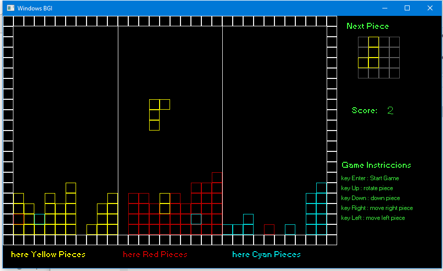

# Tetris-prueva-Gameloft
Reto que envia Gameloft al solicitar empleo

prueba Gameloft, que consistia en hacer un tetris modificado los requisitos completos estan en el pdf que recibi que se encuentra en la carpeta "prueva pdf" de este repositorio. termine una primera version la envie y me contestaron que tenia varios bugs por falta de tiempo no lo termine de corregir, cabe mencionar que corre muy bien cumple con el 80% de lo que me pidieron realizar puede verse en el ejecutable que esta en la carpeta "tetris exe".
fue desarrollado en C++ usando CodeBloks 16.01. solo use una libreria que me permitiera pintar cuadrados y texto, leer la tecla precionada. use Winbgim, una libreria muy vieja pero sirve.

Todo el codigo esta comentado.
